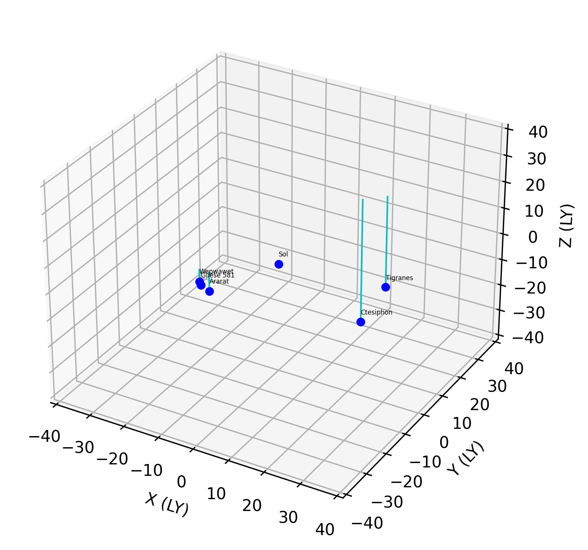
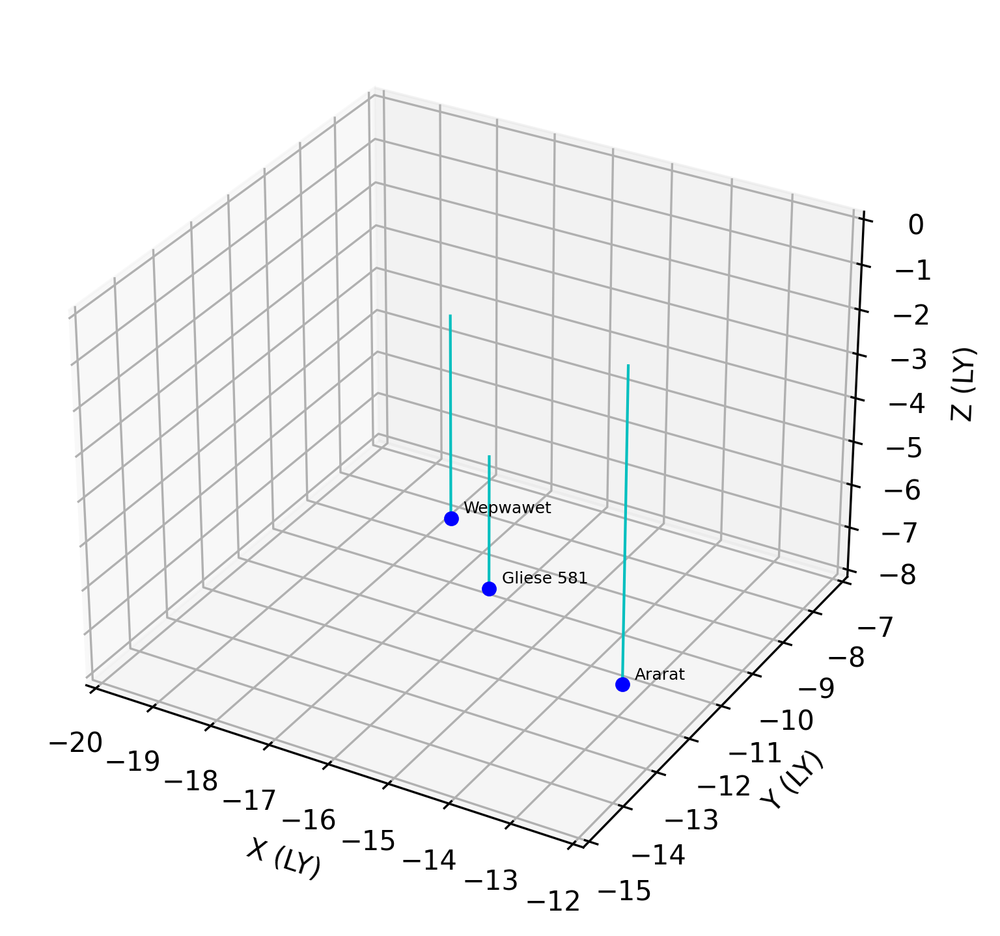

Astronomical calculations for [_The Epiphany of Gliese 581_][eog581].

[eog581]: https://borretti.me/fiction/eog581

# Gallery

All place names:

Zoomed in around Gliese 581:

Network route from Ctesiphon (Beta Pictoris) to Wepwawet (Gliese 555), shortest
path with laser links limited to 16 light years:

# License

Copyright (c) 2022 Fernando Borretti
