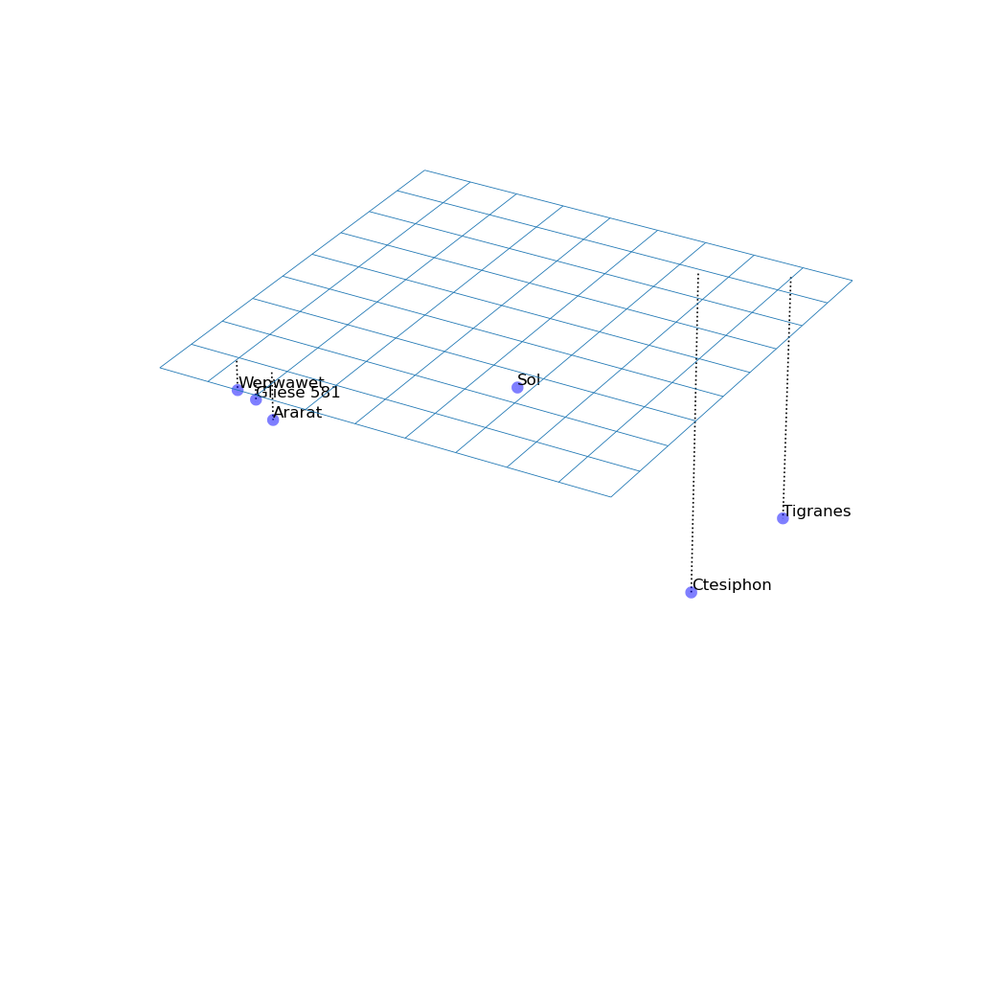
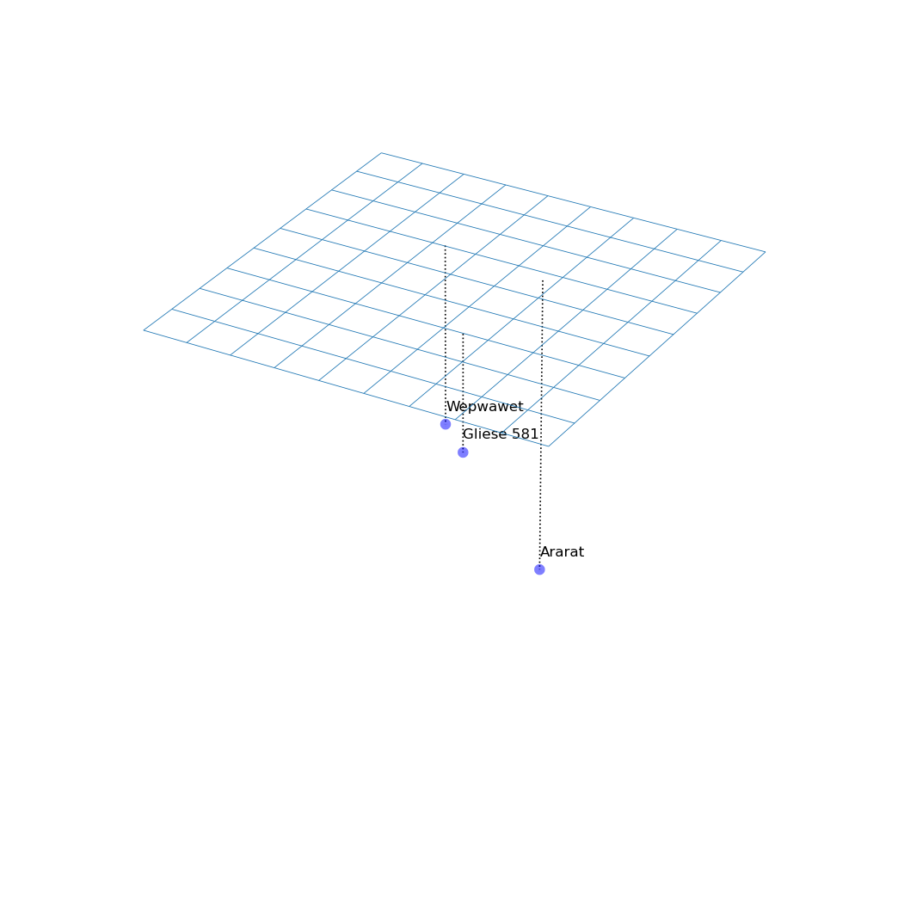
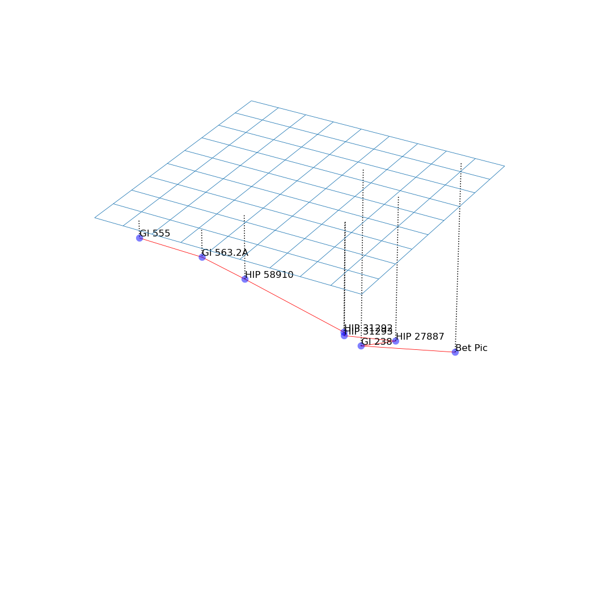

Astronomical calculations for [_The Epiphany of Gliese 581_][eog581].

[eog581]: https://borretti.me/fiction/eog581

Files:

- `astro.lisp`: the core astronomy framework, CLOS classes to represent
  equatorial/cartesian coordinates, parse the HYG database, etc.
- `dijkstra.lisp`: an implementation of Dijkstra's algorithm.
- `test.lisp`: tests of the astronomy and graph routing code.
- `notebook.lisp`: the code specific to the story.

# Gallery

All place names:

Zoomed in around Gliese 581:

Network route from Ctesiphon (Beta Pictoris) to Wepwawet (Gliese 555), shortest
path with laser links limited to 16 light years:

# License

Copyright (c) 2022 Fernando Borretti
